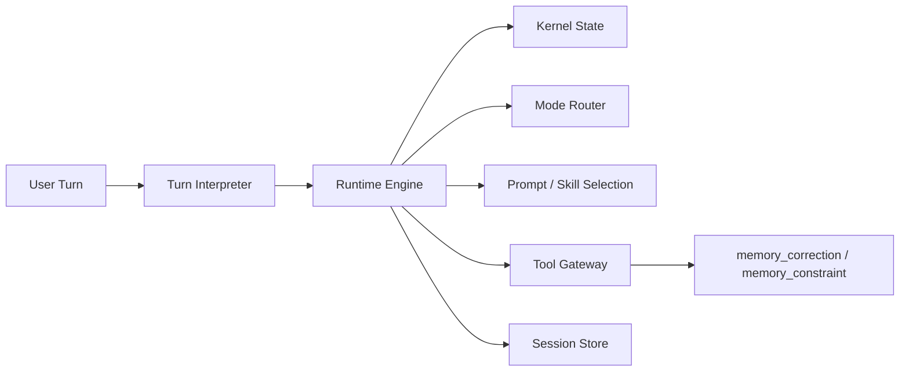

# ADR-0012: Turn Interpretation and Skill Routing Layer

**Date:** 2026-04-03
**Status:** Accepted
**Deciders:** Assistant, User
**Last Reviewed:** 2026-04-03
**Reviewers:** KB Labs Agents Team
**Tags:** [agent-runtime, sdk, extensibility, memory, prompt]

## Context

The new kernel/store/runtime architecture already improves continuity, evidence retention, and session persistence. We also introduced a canonical session memory commit path through `memory_correction` and `memory_constraint`, backed by `KernelState` and `SessionArtifactStore`.

However, one important gap remains:

- The runtime still needs to decide whether a user turn is a new task, follow-up, correction, or new lasting instruction.
- Today that detection is partially heuristic.
- Heuristics are acceptable as a temporary fallback but are not an acceptable long-term architectural source of truth.

This problem is broader than memory persistence.

The same interpretation layer will later be needed for:

- skill-based prompt selection
- mode routing
- tool capability prioritization
- delegation and planning policies
- constraint persistence and invalidation

If this logic remains distributed across prompt text, middleware, and ad-hoc conditionals, the system will regress into fragmented state ownership again.

We need a first-class runtime layer that:

1. interprets the current turn in structured form
2. is extensible through the SDK
3. feeds the kernel instead of bypassing it
4. can later drive skill-based prompting and policy routing

## Decision

We will introduce a new first-class runtime extension point: **Turn Interpreter**.

The Turn Interpreter is responsible for interpreting the current user turn relative to the active session and returning a structured result. It does not own memory, does not write artifacts directly, and does not mutate the runtime by itself.

Its output is consumed by the `RuntimeEngine`, which then updates the `KernelState` and may require a canonical memory commit before run completion.

### Architecture



### New Runtime Contract

The system will introduce a structured turn interpretation result:

```ts
type TurnKind =
  | 'new_task'
  | 'follow_up'
  | 'correction'
  | 'constraint'
  | 'mixed';

type TurnInterpretation = {
  kind: TurnKind;
  shouldPersist: boolean;
  persistenceKind?: 'correction' | 'constraint';
  persistStrategy?: 'record_directly' | 'explicit_commit';
  content?: string;
  invalidates?: string[];
  confidence: number;

  suggestedMode?: 'assistant' | 'autonomous' | 'spec' | 'debug';
  suggestedSkills?: string[];
  suggestedPromptProfile?: string;
  suggestedToolCapabilities?: string[];
};
```

### SDK Extension Point

The interpreter must be extensible through the SDK:

```ts
interface TurnInterpreter {
  id: string;
  supports(mode: AgentMode | 'assistant' | 'autonomous'): boolean;
  interpret(input: {
    sessionId?: string;
    mode: AgentMode | 'assistant' | 'autonomous';
    message: string;
    kernel: KernelState | null;
  }): Promise<TurnInterpretation | null>;
}
```

The `AgentSDK` will expose:

- `registerTurnInterpreter(interpreter)`
- `turnInterpreters: TurnInterpreter[]`

### Runtime Lifecycle

The runtime turn flow becomes:

1. user message arrives
2. `RuntimeEngine` loads current kernel
3. `RuntimeEngine` invokes interpreter chain
4. best interpretation is selected
5. `Kernel.ingestUserTurn()` receives both raw text and structured interpretation
6. kernel updates objective, constraints, pending actions, invalidations
7. main agent loop executes
8. if interpretation requires explicit persistence, completion is gated until canonical commit is done

### Kernel Responsibilities

`KernelState` remains the authoritative source of truth.

The kernel will:

- track current task and objective
- track constraints and corrections
- store optional routing hints derived from turn interpretation
- create pending memory commit actions when required
- mark pending actions complete after `memory_correction` / `memory_constraint`

The kernel will not be responsible for inferring the semantic kind of the user turn from raw text.

### Completion Gate

If a turn interpretation uses `persistStrategy: 'explicit_commit'`:

- the kernel creates a pending action
- `report` cannot finalize the run while that pending action remains open
- the model must first call `memory_correction` or `memory_constraint`
- after the memory tool succeeds, the pending action is closed
- only then may the run complete

This makes correction persistence a runtime policy, not a prompt suggestion.

If a turn interpretation uses `persistStrategy: 'record_directly'`:

- the kernel records the interpreted constraint/correction immediately
- no explicit `memory_correction` gate is created
- this is used for baseline task constraints on a fresh session, where the user is setting the initial ground rules rather than correcting an already-running session

### Default Implementation

The default implementation is a lightweight structured interpreter:

- small LLM call
- one dedicated classification tool schema
- low token footprint
- heuristic fallback only when the structured interpreter is unavailable

Heuristics remain a temporary resilience path. They are explicitly not the architectural source of truth.

### Future Capability Routing

The same interpretation layer will later drive:

- skill-based prompt activation
- prompt profile selection
- mode suggestions
- tool capability prioritization
- delegation hints

In the current implementation, these hints are stored canonically in `KernelState.routingHints` and exposed to prompt projection, but they are not yet applied as hard runtime routing decisions.

This is intentional. Turn interpretation is designed as a reusable routing primitive, not a one-off correction detector.

## Consequences

### Positive

- Introduces a clean, extensible answer to turn classification
- Removes long-term dependence on regex and prompt-only behavior
- Keeps kernel as the single source of truth
- Enables stronger correction persistence and completion guarantees
- Provides a foundation for skill-based prompting and policy routing
- Allows different interpreters by mode or domain without rewriting runtime internals

### Negative

- Adds a new runtime concept and contract surface
- Default LLM-based interpretation adds one more small model step
- Requires migration of current heuristic logic out of the kernel
- Needs careful observability so interpretation errors are debuggable

### Alternatives Considered

- Keep regex/keyword detection in kernel
  Rejected because it is brittle, language-dependent, and not extensible enough.

- Rely entirely on the main model to remember to call `memory_correction`
  Rejected because it provides weak guarantees and fails silently in longer sessions.

- Hardcode mode-specific correction handling in prompts
  Rejected because it spreads state semantics across prompt construction and mode logic.

- Build a large standalone classification subsystem
  Rejected because it is too heavy for the current stage and unnecessary for v1.

## Implementation

### Phase 1

- Add `TurnInterpretation` and `TurnInterpreter` contracts
- Add SDK registration surface
- Add runtime interpreter orchestration
- Add default interpreter implementation

### Phase 2

- Change `Kernel.ingestUserTurn()` to accept structured interpretation input
- Move current correction-detection heuristics behind fallback interpreter logic
- Keep completion gate backed by pending memory commit actions

### Phase 3

- Route skill suggestions through prompt projection / prompt profile selection
- Route mode suggestions through `ModeRouter`
- Add observability for interpretation decisions and confidence

### Migration Notes

Current state already includes:

- canonical memory commit via `memory_correction`
- canonical session memory bridge
- pending action tracking in kernel
- completion-adjacent enforcement groundwork

This ADR formalizes the next architectural step: replacing heuristic turn classification with an explicit extensible interpreter layer.

### Review Trigger

Revisit this ADR after:

- skill-based prompt routing is added
- mode selection starts consuming interpretation hints
- heuristic fallback can be retired or narrowed further

## References

- [ADR-0002: Plugins and Extensibility](./0002-plugins-and-extensibility.md)
- [ADR-0003: Package and Module Boundaries](./0003-package-and-module-boundaries.md)
- [ADR-0003: Execution Memory for Learned Facts](./0003-execution-memory.md)
- [ADR-0010: Adaptive Context Optimization for Agent Execution](./0010-adaptive-context-optimization.md)
- [ADR-0011: File Change History and Rollback System](./0011-file-change-history-and-rollback.md)

---

**Last Updated:** 2026-04-04
**Next Review:** After skill-based prompt routing starts consuming interpretation hints
